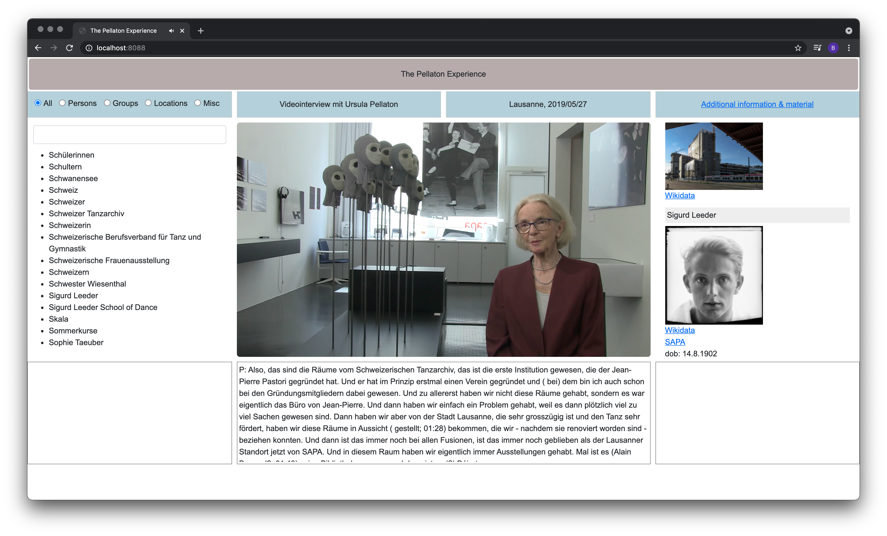

# The Pellaton Experience

Turning oral history into an interactive information network

Ursula Pellaton (\*1946) is a walking encyclopedia of Swiss dance history. Her enthusiasm for dance began in 1963 with a performance of *Giselle* in Zurich. That was the beginning of her many years of involvement with dance, which has accompanied her ever since as a journalist and historian, among other things.

She shared a lot of her knowledge in 16 hours of video recordings that were the basis for a biography in traditional book form. However, both video and book are limited by their linear narratives that differ from our experience of history as a living network of people, places, events, and works of art. Based on a longer excerpt from the recordings and its transcript, we tried to turn this oral history document into a comprehensive online experience by creating a navigable interface and augmenting the video with supplementary information and material.

[sapa.github.io/pellaton-challenge](https://sapa.github.io/pellaton-challenge)

This conceptual prototype was produced in two days during the [\#GLAMhack2021](http://make.opendata.ch/wiki/event:2021-04). It explores options as much a challenges in turning a 3.5 hours video (one out of four) and its transcript into an explorable information space.

### Technical process

#### Parsing the transscript

The [transcript](data-preparation/20192705_Pellaton_Ausdruckstanz_unkorrigiert.txt) is a loosely structured text document with sporadic timecodes. In a first step this document was automatically split into segmenents and via named-entity recognition (NER) persons, organisations, locations, and misc. entities were extacted. The technical details are documented [here](data-preparation/README.md).

#### Editing the extracted data

The result were copied into a GoogleDocs spreadsheet to allow collaborative editing. In this manual editing process varying names of the same entity were merged. Entities were reconceiled against Wikidata and SAPA's own [database](https://performing-arts.ch) with OpenRefine. And finally image URLs from Wikimedia Commons or SAPA's IIIF server were added.

A Python script ([`render-json.py`](render-json.py)) imported the spreadsheets directly from Google and converted them into JSON. The authentication file for the Google API is not part of this repository. Instead a downloaded version of the spreadsheet ([`PellatonData.xlsx`](PellatonData.xlsx)) is stored here. The script also collected additional data (date of birth, date of death) via the Wikidata API for all entities with a Wikidata URI. The final JSON file ([`pellaton.json`](pellaton.json)) contains two list:

1. segments with start times in seconds, the transcript excerpt, and a list of normalized entity names.
2. entities with normalized names, name variations and additional data (URIs, image URLs, live dates).

#### User interface

The user interface of the prototype provides the video directly from Vimeo and uses the Vimeo API to interact with it. On the left one finds a list of all entities, which can be filtern by type or text search. A click on one of the entities sets the playhead of the video to the first segment, in which the entities occur. A jump to further occurances would require additional interface elements.

Below the video the excerpt from the transcript for the current segment is shown. Here the entities could be highlighted based on the information from the JSON file. On the right all entities from the current segment are shown with their additional information.

### Team

* [Simona](https://github.com/simonada)
* [Jelke](https://github.com/JelkeJL)
* [Roberta](https://github.com/Padlina)
* Annika
* [Katrin](https://github.com/katrinoettli)
* [Birk](https://github.com/birk)